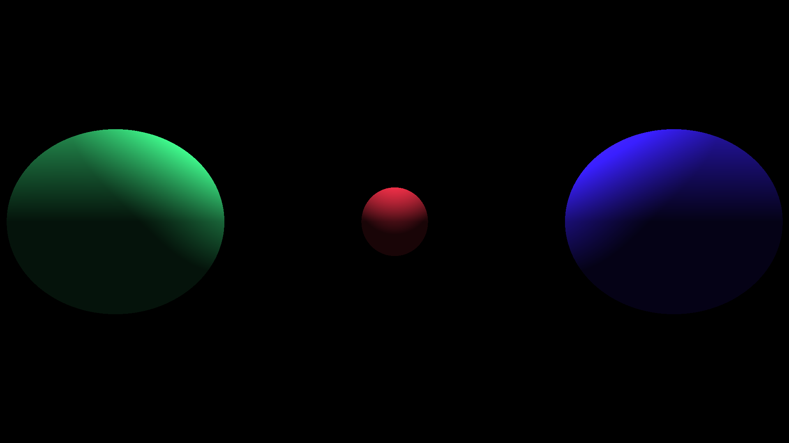
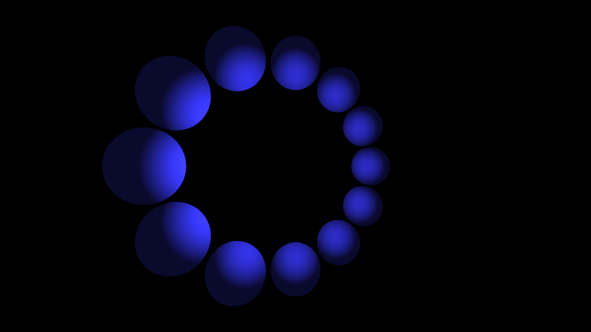
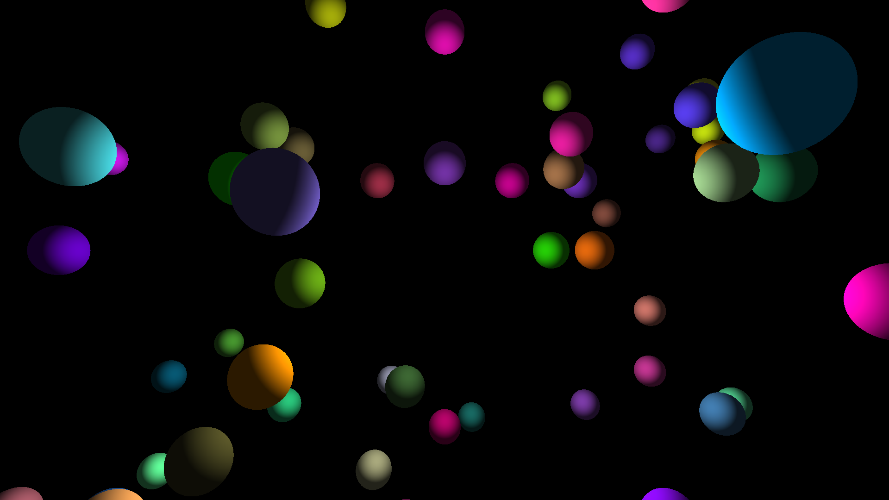

# Teeny Tiny Raytracer

A little renderer based on https://gabrielgambetta.com/computer-graphics-from-scratch/

It just renders spheres and a few different types of light, without shadows.
I always wanted to write some kind of 3D graphical thing, so I finally took
an afternoon and did it.

# Some outputted scenes

